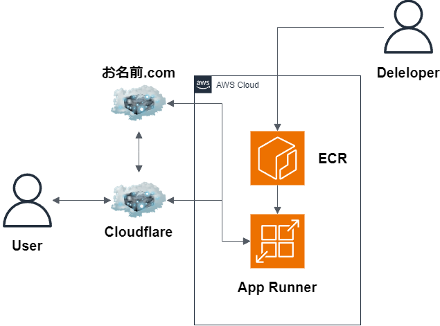

# バックエンドAPI + CloudFlareのお試しサンプル

## summary

Go/EchoのバックエンドAPI を AWS App Runner や AWS ECS などでクラウドに構築することがメインでした。
更に ACM や Route53 を使い、SSL化やカスタムドメイン化を行ってきましたが、
CloudFlare でも可能ということを知り、導入検証を行いました。

## CloudFlareについて

CloudFlareについては以下URLへ飛んでください。

[CloudFlare](./manuals/cloudflare.md)

## アーキテクチャー

## コマンド

以下ファイルに記載しました。

[コマンド集](./manuals/commands.md)

## マニュアル

以下ファイルにCloudflareの導入手順書を記載しました。

[マニュアル集](./manuals/manuals.md)

## URL

[Cloudflare](https://www.cloudflare.com/ja-jp/)